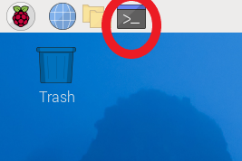

# Raspberry Pi GATT Server
This is a Bluetooth Low Energy GATT server that is designed to listen for connections from a device looking for an ASCOM flat box.

# Installation
## Setup the Raspberry PI
This repository can be downloaded in .zip format and unzipped in a directory on a raspberry pi. The installation has been checked on a raspberry pi 3B and 4B as well as a raspberry pi zero 2 W, although the zero is slower than the 3B and 4B. The installation requires an SD card. I am not sure the minimum size required for a full OS, but I download a full OS and I use a 32GB card.

Initial installation would be to download the installer from here:

https://www.raspberrypi.com/software/
  
  
  
After the installer is downloaded, the settings I use to install the Raspberry Pi OS in early 2025 are (the installer settings may evolve over time):
  
  
  
For troubleshooting and configuration, this web page may be helpful:

https://www.raspberrypi.com/documentation/computers/configuration.html

Follow the instructions of the installer and setup the installer to connect to your local wifi because new libraries will have to be installed for the server to run.

Place the SD card into the raspberry pi and turn it on. A monitor with keyboard and mouse will make it easier for installation, although it is possible to use ssh to do this part of the installation.

## Setup the server

Once the raspberry pi boots up, open a terminal:  
 
 
 
 
 
 
 
 
 
In order to upgrade the raspberry pi installation to the latest available libraries, type:

sudo apt update 
sudo apt upgrade  
 
 
 
 
 
 
    
In order to install the required libraries for the server, type this in the terminal:

python -m venv ~/py_envs

~/py_envs/bin/pip install pillow

sudo apt-get install python3-pil.imagetk

## Setup the server to launch on startup

Move or place the launcher.sh in some directory such as the home directory. You then need to make that file executable, so run the following command:

chmod 777 launcher.sh

You need to edit that file to change the location of the 'cd /path/to/server/GATT' to wherever you placed the directory that includes the BlueChickServer.py file. You can use the following to edit the file:

sudo nano launcher.sh

From the home directory, make the subdirectory:

mkdir .config/autostart

Place the MyApp.desktop in the .config/autostart directory. You then need to make that file executable, so run the following command:

chmod 777 .config/autostat/MyApp.desktop

You need to edit that file to change the location of the following to wherever you placed the launcher.sh file. Again, you can use the 'sudo nano MyApp.desktop' to edit the file wherever you placed it:

Exec=bash -i /path/to/launcher/launcher.sh

The raspberry pi should now reboot to have the blue bluetooth screen visible. Sometimes, without explanation that I can find, the blue screen will not boot to a full screen. Restarting the raspberry pi seems to fix this.

