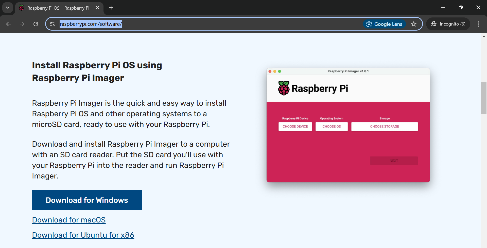
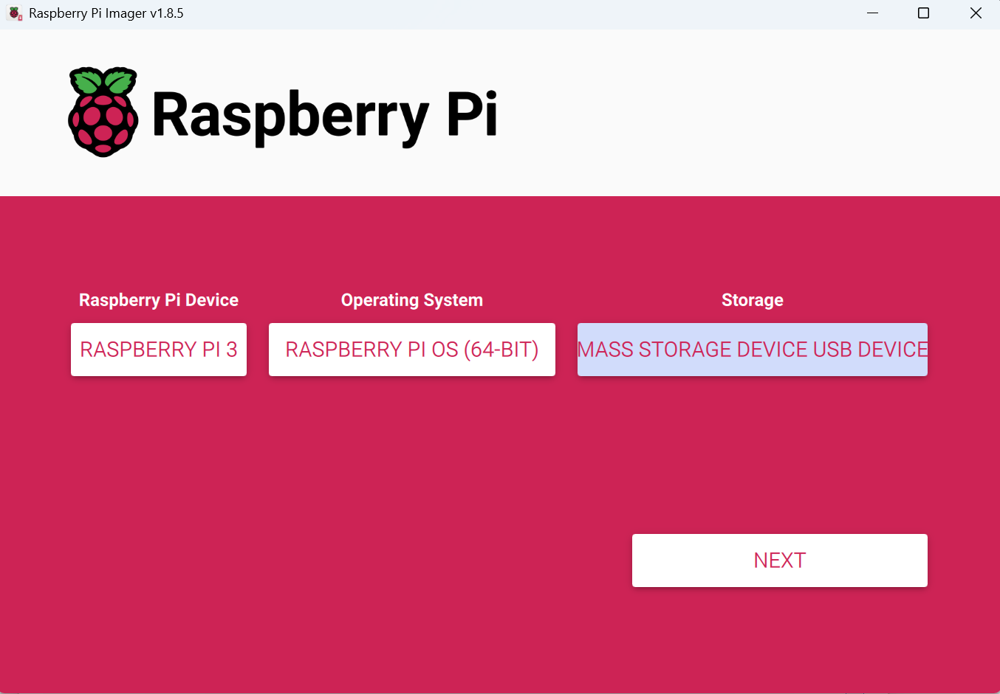

# Raspberry Pi GATT Server
This is a Bluetooth Low Energy GATT server that is designed to listen for connections from a device looking for an ASCOM flat box.

# Installation
This repository can be downloaded in .zip format and unzipped in a directory on a raspberry pi. The installation has been checked on a raspberry pi 3B and 4B as well as a raspberry pi zero 2 W, although the zero is slower than the 3B and 4B. The installation requires an SD card. I am not sure the minimum size required for a full OS, but I download a full OS and I use a 32GB card.

Initial installation would be to download the installer from here:

https://www.raspberrypi.com/software/

After the installer is downloaded, the settings I use to install the Raspberry Pi OS in early 2025 are (the installer settings may evolve over time):

For troubleshooting and configuration, this web page may be helpful:

https://www.raspberrypi.com/documentation/computers/configuration.html

Follow the instructions of the installer and setup the installer to connect to your local wifi because new libraries will have to be installed for the server to run.
Place the SD card into the raspberry pi and turn it on. A monitor with keyboard and mouse will make it easier for installation, although it is possible to use ssh to do this part of the installation.
Once the raspberry pi boots up, open a terminal 
